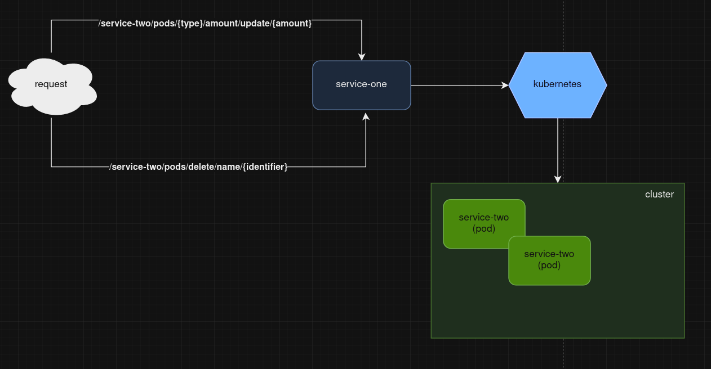
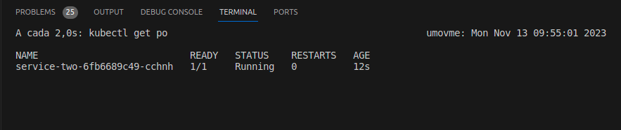

# Go Pods Poc
Este projeto é uma poc em Go que busca gerenciar pods de uma aplicação a partir de outra aplicação.



## Dependências
* Go versão 20
* [Kind](https://kind.sigs.k8s.io/)
* [Kubectl](https://kubernetes.io/pt-br/docs/tasks/tools/#kubectl)
* Docker
* Make


## Formas de rodar

### Makefile

Criar cluster

``` 
make cluster 
```

Criar imagens docker

```
make docker-img
```

Carregar imagens para cluster

```
make docker-img-to-cluster
```

Aplicar configurações de k8s ao cluster

```
make set-pods
```

Expor portas

```
make port-forward
```

OBS: no arquivo makefile há também chamadas para desfazer as configurações acima.

## Testando via Rest

### Scaling de pods

```
POST /service-two/pods/{type}/amount/update/{amount}
```
* type é deployment ou hpa e depende de qual replica você deseja ajustar
* amount é será o novo valor de réplicas de pods

### Delete de pod

```
POST /service-two/pods/delete/name/{identifier}
```
* identifier é o nome do pod

## Respostas

#### Sucesso

#### /service-two/pods/{type}/amount/update/{amount} 
```
Pods updated: {amount}
```

#### /service-two/pods/delete/name/{identifier}

#### Erro
Dependerá de onde estourar erro, mas via de regra virá uma string contendo uma descrição do erro acompanhado de sua causa.
Ex.:
```
Error building config from flags. Reason: stat ./kubeconfig.yaml: no such file or directory
```

### Acompanhando os pods em tempo real

Requisitos: Rodar comando via terminal
```
watch 'kubectl get po'
```
Haverá algo similar à imagem abaixo:


### Lista de comandos úteis
[Doc Aqui](./docs/commands.README.md)